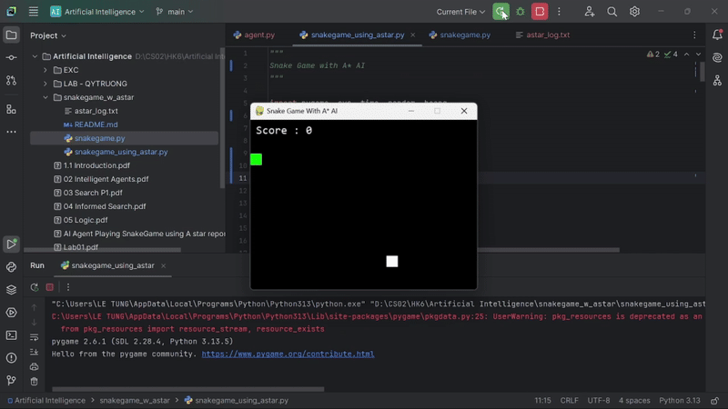

# 🐍 Snake Game Using A* Algorithm

## 📖 Giới thiệu
Đây là dự án mô phỏng trò chơi **Snake (Rắn săn mồi)**.  
Điểm đặc biệt là thay vì người chơi điều khiển, con rắn sẽ được điều khiển tự động bằng **thuật toán A*** để tìm đường đi ngắn nhất đến thức ăn.

---

## ⚙️ Yêu cầu
- Python 3.8+
- Thư viện:
  - `pygame`
Cài đặt bằng:
```bash
    pip install pygame
```
---
## 🚀 Cách chạy
Chạy trò chơi với AI A*:
```bash
    python snakegame_using_astar.py
```
---
## 🎮 Cách hoạt động

Rắn bắt đầu ở góc trên bên trái màn hình.

Mỗi khi sinh ra thức ăn, AI sẽ dùng A* để tính đường đi ngắn nhất từ đầu rắn → thức ăn, tránh va vào thân rắn.

Nếu không còn đường hợp lệ → game over.

Khi ăn được thức ăn, rắn dài thêm và điểm số (Score) tăng.

---
## 🧠 Thuật toán A*
Thuật toán A* là một giải thuật tìm đường (pathfinding), dùng công thức:
```bash
    f(n) = g(n) + h(n)  
```
Trong đó :
- g(n): chi phí đi từ điểm đầu đến ô n
- h(n): hàm ước lượng (heuristic) khoảng cách từ n đến đích
- Ở đây dùng Manhattan distance cho heuristic.

A* đảm bảo tìm được đường ngắn nhất (nếu tồn tại).

---
## 📷 Minh họa
Ví dụ: rắn tự động di chuyển tới thức ăn bằng đường màu xanh lá.

---
## Nguồn tham khảo
- Dự án này được xây dựng dựa trên Snake Game từ Project của rajatdiptabiswas 
- Link repo: https://github.com/rajatdiptabiswas/snake-pygame/tree/master
---
## Thành viên
- Lê Khắc Tùng
- Dương Ngọc Hoàng Huy
- Trần Minh Triết